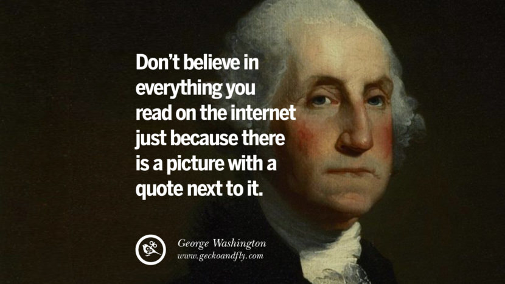

 

# Ironhack Final Projec:
by [Antonio Saleme](https://www.linkedin.com/in/antonio-saleme-sastre/)

### Index:

* [What is a fake news?](#section1)
* [Objetive](#section2)
* [First steps](#section3)
* [First ideas](#section4)
* [Second steps](#section5)
* [Conclusions](#section6)
* [Tableau](#section7)

### What is a fake news?

Fake news are stories, published on the internet and especially on social media, which are untrue, biased or exaggerated. The author deliberately publishes false information to gain political influence or to manipulate the public opinion on a certain topic.

### Objective

The objective of working on a database of fake news and real news is to apply machine learning with the aim of predicting whether a news item is fake or real. At the same time I will analyse the general characteristics of the fake news and real news:
* length of texts
* length of titles
* average length of texts and titles 
* polarity of texts
* subjectivity of texts
                                        

### First steps

The dataset I used consists of information on 44898 rows of a [Kaggle dataset](https://www.kaggle.com/clmentbisaillon/fake-and-real-news-dataset) about fake and real news from the time between March 2015 and February 2018

My first approach consisted in working on a small sample of the information first in order to try out the effectiveness of the process quickly and apply the steps to the whole dataset later on. These are the different steps of the process:
                       * Importing the data
                       * Exploring the data (EDA Method)
                       * Cleaning the data
                       [link to: final project | cleaning sample]
                       [link to: final project | cleaning complete data]
                               

### First ideas
The first challenge was to prepare the data in the best way to gain as much information as possible and to allow machine learning to work correctly. I applied "regex" to change the $ symbol to the word "dollar", to remove links to websites as well as characters and digits. Stopwords were removed before and after the "regex" process. I was also interested in removing the pronoun "us" while leaving untouched the abbreviation "us" for U.S. (United States, without the dots and in lowercase letters).

### Second step

Y decided to use 3 new notebooks for this project: One for the machine learning, another one for vizualisation and the last one for the NLP
[Link to fake and real news machine learning]
[Link to fake_and_real_news_viz]
[Link to fake and real news viz- NLP]

### Conclusions

After completing the process I noted that at fist sight the characteristics of fake news and real news were very similar. Looking more closely I found some surprising results: While real news news have longer texts, fake news have 220.86% more unique words. The polarity of the two news types is almost equally high but subjectivity is much higher in fake news. Another striking peculiarity is, that the number of real news grew by 478% between august and october 2017. 
The good news is that machine learning is able to analyse whether an article is fake news or real news with an effectiveness of 98%.

### Tableau

For this Ironhack project I decided to do the presentation on Tableau if you would like to see it, please visit my Tableau profile [Link to tableau story](https://public.tableau.com/profile/antonio.saleme#!/)

